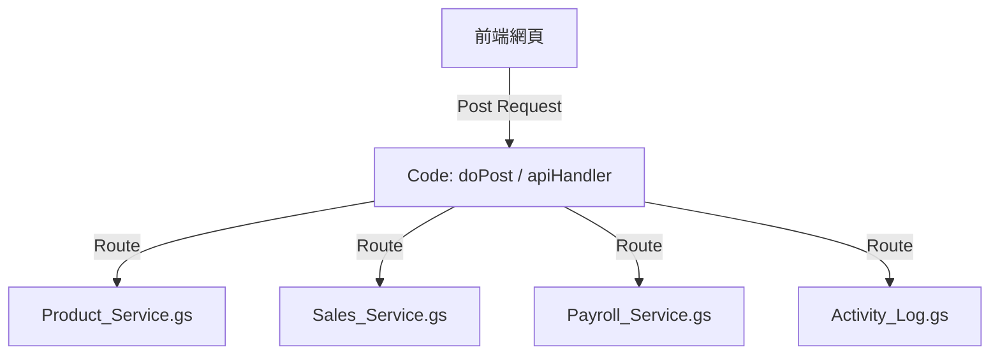

# 後端架構「一函數一檔案」精確整合計畫

為了滿足極致的維護性並徹底杜絕 Google Apps Script (GAS) 的代碼蓋台問題，我們將捨棄「大檔案」架構，改採「每個 Service 對應一個檔案」的模組化方案。

## 1. 核心設計理念
在 GAS 中，所有 `.gs` 檔案共享同一個全域空間。將函數獨立成檔案有以下好處：
- **名稱唯一性**：檔名即功能名，一眼就能看出代碼在哪。
- **避免衝突**：不存在兩個檔案定義同個函數的問題，因為開發時會直接看到檔案重複。
- **維護簡單**：修改特定功能（如「薪資」）只需打開對應的檔案，不必在千行代碼中搜索。

## 2. 預計拆解後的檔案清單 (部分範例)
我們將把目前的 4 個大檔案拆解為具有語意化的個別檔案：

### [進入點]
- `Main_Router.gs` (含 `apiHandler`, `doPost`, `doGet`)
- `Auth_Service.gs` (含 `login`, `verifyToken`)

### [商品與庫存]
- `Get_Products.gs` (即 `getProductsService`)
- `Update_Product_Sort.gs` (即 `updateProductSortOrderService`)

### [銷售管理]
- `Save_Sales.gs`
- `Get_Sales_History.gs`
- `Get_Receivables.gs`

### [薪資與支出]
- `Save_Payroll.gs`
- `Get_Payroll_Data.gs`
- `Save_Expenditure.gs`

---

## 3. 實施步驟
1. **清理影子檔案**：請使用者在雲端手動刪除 `Database.gs`, `Inventory.gs` 等舊檔案。
2. **本地拆解**：我會幫你在本地將 `Code.gs`, `Sales.gs` 等拆解成多個獨立的 `.gs` 檔案。
3. **逐一貼上**：你只需在 GAS 編輯器點擊「+」新增對應檔名的檔案，並把代碼貼入即可。

---

## 4. 目標架構圖 (Mermaid)

## 5. 存檔與部署
- 此計畫書將存檔於本地 `/brain/` 目錄。
- 建議整合後進行一次 Git Commit 紀錄這套新架構。
